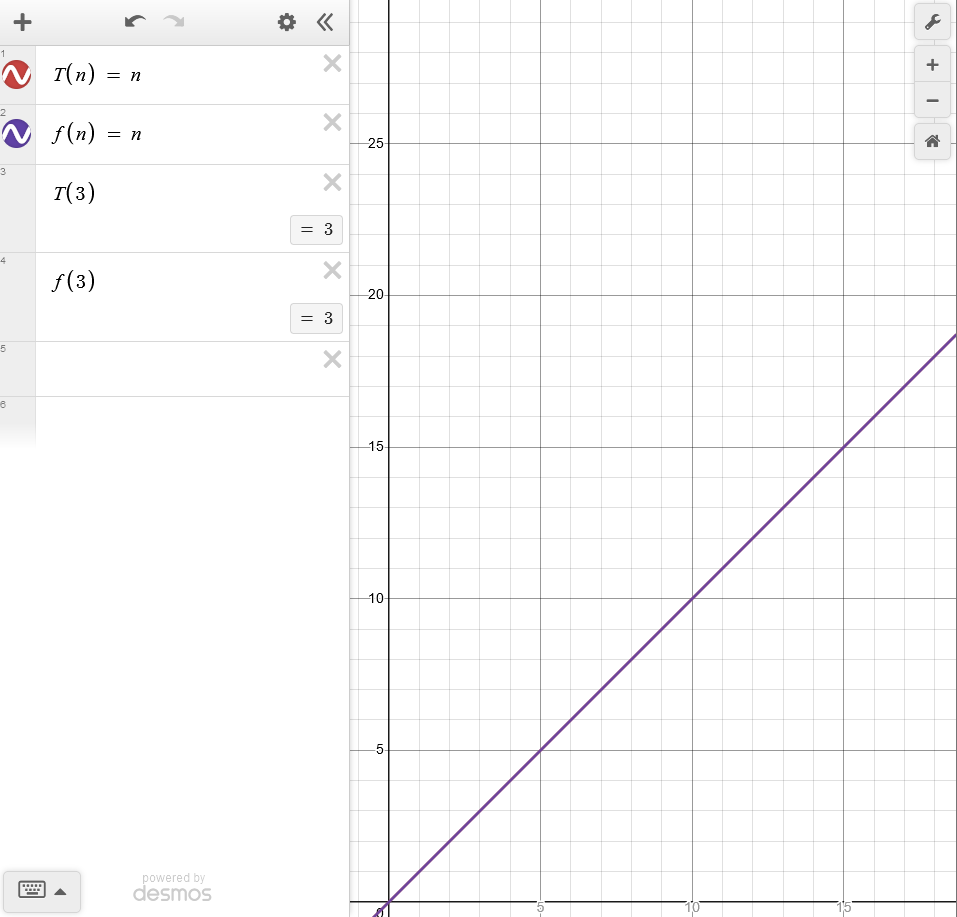
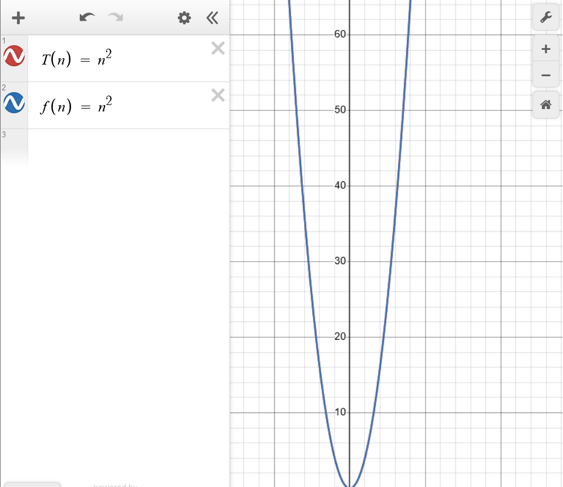

## Introduction
This is a beginners introduction to learning about CS applications of asymptotic analysis. As you'll come to see, I leave out more complex topics, they're not vital to understanding the rudimentals of asymptotic analysis. I specifically left out masters theorem for calculating work functions for DAQ algorithms and recursive algorithms. In the examples, we won't use recurrence relations, the examples will be so simple that we can visually see what the work function would look like.

However, you can find some resources here:
* Masters theorem: https://en.wikipedia.org/wiki/Master_theorem_(analysis_of_algorithms)
* Recurrence relations: https://en.wikipedia.org/wiki/Recurrence_relation
* Using recurrence relations: https://opendsa-server.cs.vt.edu/OpenDSA/Books/CS4104/html/Recurrence.html

## Preliminary info
I'm going to assume you know some basic level of algebra, to the point that you understand what functions are. You might need some introductionary calculus for limits and function growth.

Here are some things you should know before jumping into this: 

* iff - If and only if. Further explanation here: https://www.youtube.com/watch?v=OK-ZAbcmmg0
* Algorithm - Some set of steps utilized to solve a problem or task. In this post we'll model the work an algorithm does as a function known as $T(n)$.
* Limits - Are a concept that describes how functions inputs approach an output. Approach here means it describes the points that lead to the output, but not actually describing the output itself. Limits look like this:
    $\lim_{x \to \infty}(x + 1)$.
    This describes how $x$ approaches $x + 1$.
* Bounding functions - Are functions that cover the region above or below another functions graph. For example the function: $f(x) = x ^ 2$ is an upper bounding function to the function $g(x) = y$ because $f(x)$ grows faster than $g(x)$.
* Asymptotic behavior - Is the behavior of some function $f(x)$ as it experiences limiting behavior. Limiting behavior (also known as tail / end behavior) is the behavior of a function as we give it either really large inputs or really small inputs.

## What's asymptotic analysis (in CS)?
Asymptotic analysis is analyzing an algorithm's behavior as we give it really large inputs; we only care about really large inputs in CS. We analyze the behavior by converting the algorithms work into a function that I call a "work function" or $T(n)$.

## Why does this matter to programmers?
Understanding how to use these notations, and their differences is because it allows us to model how algorithms' performance scales with large inputs. This is primarily useful for software engineers or systems engineers that deal with a large amount of data.

Heavy emphasis on the "**how algorithms' scale at large inputs**" part from our previous paragraph. These notations do **NOT** describe how fast the algorithms are, it strictly describes how they grow given large inputs. Just because an algorithm has a faster or slower time complexity than another, doesn't mean it's faster or slower.

## Big O notation
Big O notation is what we utilize when we want to describe an upper bounding function to our algorithms work (which is $T(n)$). We do this so we can approximate the worse case scenario of an algorithm. Let's formally define our big O function.

### Formal definition
let $k$, $n$ = some positive natural number

$$
T(n) = O(f(n)) \text{ iff } T(n) <= f(n) * k \text{ for all } n >= n_0
$$

$\text{ as } n \to \infty$

### Definition explanation
*What even is that?* Lets go over this equation. It basically says $T(n)$ is upper bounded by $f(n)$ if and only if the range of $f(n) * K$ is larger than or equal to the range of $T(n)$ after the $n_0th$ value as $n$ approaches infinity. 

### Examples of upper bounding functions
Let's visualize what upper bounding looks like. We'll define our $T(n)$ to be an identity function $T(n) = n$.

There are **tons** of different functions we can choose from that we can try upper bounding our $T(n)$ functions. Some of these include:
* $f(n) = 1$
* $f(n) = n^2$
* $f(n) = n^3$
* $f(n) = log_2(n)$
* $f(n) = n!$

Some of these bounding functions have a name. For instance: 
* $f(n) = k$ - Constant time 
* $f(n) = n^2$ - Quadratic time
* $f(n) = n^3$ - Cubic time
* $f(n) = log_2(n)$ - Logarithmic time
* (you get the idea)

### Example 1
Let's analyze linear searching time complexity.

```c
size_t linear_search(int *array, int element, size_t n) {
    for(size_t i = 0; i < n; ++i) {
        if(array[i] == element) {
            return i;
        }
    }

    return -1;
}
```

As the name implicates, linear search runs in $O(n)$. This is because ``f(n) = n`` will always be greater than or equal to the maximum amount of iterations. Let's prove this by passing an input array of

```c
int array[5] = {1, 2, 3, 4, 5};
size_t n = 5;

linear_search(array, 3, 5);
```

### Example 1 analysis

The loop will iterate at 3 times, so the function $T(3) = 3$ and $f(3) = 3$. If we recall back to our formal definition, $T(n) = O(f(n))$ if and only if $T(3) <= f(3)$, in this case it's true thus making $f(n)$ an upper bounding function to $T(n)$.

Here's a visualization of the functions graphs:



We see that the graphs of both functions overlap with one another meaning they're equal. This further proves that $T(n) = O(f(n))$.

### Example 2
Let's analyze bubble sorts time complexity.

```c
void bubble_sort(int *array, size_t n) {
    for(size_t i = 0; i < n; ++i) {
        for(size_t j = i + 1; j < n; ++j) {
            if(array[i] > array[j]) {
                swap(array[i], array[j]);
            }        
        }
    }
}
```

Bubble sort runs in $O(n^2)$.

### Example 2 analysis
So we're going to model a function $T(n) = n^2$ to represent the work of our algorithn. The reason for it's $n^2$ is because the outer loop runs $n$ times and the inner loop runs $n$ times thus collasping to $n^2$.

Let's visually prove that $T(n) = O(f(n)) \text{ s.t } f(n) = n^2$.



As we can see, the 2 functions' graph seem to overlap, thus meaning that $T(n) = O(f(n))$ is true for this example.

### Example 3
Let's now analyze a contrived algorithm that consists of 2 loops, but isn't $O(n^2)$.

```c
void algo(int n) {
    for(int i = 0; i < n; ++i) {
        for(int j = 0; j < 10; ++j) {
        }
    }
}
```
This algorithm runs at $O(n)$.

### Example 3 analysis
The reason this algorithm runs in $O(n)$ instead of $O(n + 10)$ is because in big O notation, constants are dropped in the simplified form.

I'm not going to visualize the work function because it simplifies into the same example as the first one I demonstrated.

### Constants
From our previous graph we noticed that the actual complexity was $O(n)$ instead of $O(n + 10)$. The reason for this is that big O notation actually drops constant values, the reason for this is because big O notation doesn't care about where the graph starts, it just cares about it's behavior and shape which helps us describe how an algorithm's grows.

If we recall from a previous section, we say that an algorithm's time complexity doesn't mean it's faster or slower than another algorithms time complexity. This is because constants matter in the context that we're measuring speed. However, we're not measuring speed instead we are measuring growth over large inputs.

### Conclusion
I have a confession to make. All of my examples are misleading, I am giving a tight bound equation for the algorithms. This makes it harder to visualize the "upper" bounding part of big O. We can sort of think of big O as a way of describing a set of upper bounding functions in relation to some work function. Bubble sort can be upper bounded by any polynomial function in the form: $O(n^c)$ such that $c > 2$, and any other function that grows faster than a quadratic. We go over tight bounding and what we should actual use later on in the article.

In summary, we utilize big O notation for describing the upper bounding behavior of an algorithm. This can be used to approximate but not precisely describe the worst case scenario for an algorithm.

## Big Omega notation
If you understood big O notation, then this should come pretty easy to you, it's the same concept but we flip it and we look for lower bounding functions that graph below our original work functions graph. We typically associate the best case scenario with big omega.

There will be no need for visualizations or example analysis because once you understand big O it's easy to translate these ideas into the different notation forms. In this case, we care about the complete opposite of what big O would care about.

### Formal definition
let $k$, $n$ = some positive natural number

$$
T(n) = \Omega(f(n)) \text{ iff } T(n) >= f(n) * k \text{ for all } n >= n_0
$$

### Definition explanation
We read this equation as $f(n)$ is a lower bound of $T(n)$ if and only if the range of $T(n)$ is less than or equal to the rnage of $f(n) * k$. Basically, $f(n)$ is a lower bound to $T(n)$ when their graphs overlap or when $f(n) * k$ is lower than $T(n)$.

## Theta notation
Theta notation basically combines both the big omega and big O notation together to create what's known as a "tight bound".

### Tight bounding
A tight bound is an area of $T(n)$'s graph where both the upper bound and lower bound touch $T(n)$'s graph. It's better to think of it as an exact bound by telling you the algorithm is bounded on both sides. It takes the sum of the upper bound and lower bound and gives you an exact function where both touch $T(n)$. Tight bounds allow us to give more precise information when describing algorithms, most people mean to use tight bounds instead of upper bounds.

So example of a tight bound would be given that we have $\Theta(n)$ then we must also implicate that there exists some $T(n) = O(f(n))$ and $T(n) = \Omega(f(n))$.

### Formal definition
let $k_1$, $k_2$, $n$ = some positive natural number

$$
T(n) = \Theta(f(n)) \text{ iff } f(n) * k_1 <= T(n) <= f(n) * k_2 \text{ for all } n >= n_0
$$

### Defintion explanation
We read this equation as $f(n)$ is a tight bound for $T(n)$ if and only if the range of $f(n) * k_1$ (where $k_1$ is derived from the lower bound) is less than or equal to the range of $T(n)$  which is less than the range of $f(n) * k_2$ (where $k_2$ is derived from the upper bound) is greater than or equal to the range of 
$T(n)$.

### Ending notes
I want to make note that these ways of determining upper bounding and lower bounding functions aren't the only ones, there are more practical and easier ways to determine these functions. Most of them revolve around finding if the limit of the quotient of a upper / lower bounding function converges to some value or diverges to infinity.

For a list of these notations to determine these functions can be founded here: https://web.mit.edu/broder/Public/asymptotics-cheatsheet.pdf 

You can test the formulas here: https://www.wolframalpha.com/input.

Another concept I want to mention is a different way of thinking of these asymptotic notations, it's more intutitive to think of them as sets of functions. Big O being a set of upper bounding functions in relation to $T(n)$, big Omega being a set of lower bounding functions in relation to $T(n)$, and we can think of theta is an intersection of both upper bound and lower bound sets.

If you notice any grammatical issues or wrong information please contact me through an issue on my github repository for the website.
